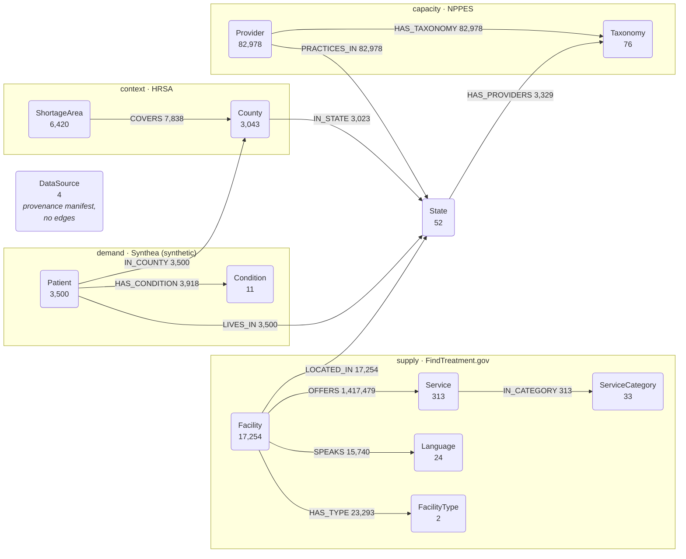

# Mental Health Knowledge Graph

**113,710 nodes. 1,665,153 edges. Four sources in one graph: every US behavioural-health facility and what it offers, the clinicians licensed to practise, the federal shortage designations, and a simulated population to measure coverage against.**


> Part of the **Samyama** ecosystem — loaded into and queried via the graph engine at [samyama-ai/samyama-graph](https://github.com/samyama-ai/samyama-graph).
> This repo holds the loader and source-data specifics for the KG.

<a href="LICENSE"></a>

---

We loaded all 17,254 facilities from [FindTreatment.gov](https://findtreatment.gov) into one graph, then asked the question a survivor advocate actually asks:

> *"Where can a survivor of intimate partner violence get trauma counselling, in Spanish, on a sliding fee scale?"*

```cypher
MATCH (f:Facility)-[:OFFERS]->(a:Service),
      (f)-[:OFFERS]->(b:Service),
      (f)-[:OFFERS]->(c:Service)
WHERE a.value = "Clients who have experienced intimate partner violence, domestic violence"
  AND b.value = "Sliding fee scale (fee is based on income and other factors)"
  AND c.value = "Spanish"
RETURN f.name, f.city, f.intake
```

**Named facilities with intake numbers, not one generic hotline.** 6,072 facilities nationally are tagged as serving IPV survivors. Powered by [Samyama Graph](https://github.com/samyama-ai/samyama-graph).

---

## Demo

A long-form narrated walkthrough of the whole graph — nine steps, ~92 seconds,
paced to be read: provenance -> supply -> the multi-constraint referral -> the
exclusion query -> simulated demand -> the coverage gap -> federal shortage
designations -> real clinical capacity -> a named clinician with a licence.

```bash
docker rm -f samyama-mh 2>/dev/null                                 # always fresh
docker run -d --name samyama-mh -p 18080:8080 \
  public.ecr.aws/f9f6l5u4/samyama-graph:1.1.0
until curl -sf http://localhost:18080/api/status >/dev/null; do sleep 1; done

# mental-health-full.sgsnap (~15 MB) is a release asset, not in this repo.
# Snapshots ship on the engine repo in the shared kg-snapshots-vN train:
#   github.com/samyama-ai/samyama-graph/releases/download/kg-snapshots-vN/
# NOT YET PUBLISHED — build with the loaders in etl/ and export your own.
curl -X POST http://localhost:18080/api/snapshot/import \
  -F "file=@mental-health-full.sgsnap"                              # ~2.5s

MH_URL=http://localhost:18080 python -m demo.demo
```

See [`demo/README.md`](demo/README.md) for re-recording, including the two
asciinema settings that quietly make the result unreadable if set wrong.

> The demo needs a **server**, not the embedded client. PyPI `samyama` 0.6.1 inverts
> `OPTIONAL MATCH` exclusion — step 4 returns the 11 facilities that *do* offer the
> excluded service instead of the 127 that do not. See [`docs/schema.md`](docs/schema.md).

---

## Schema



`State` is the hub every source joins on; `County` joins HRSA to the population.

**13 node labels** -- Provider (82,978), Facility (17,254), ShortageArea (6,420),
Patient (3,500), County (3,043), Service (313), Taxonomy (76), State (52),
ServiceCategory (33), Language (24), Condition (11), DataSource (4), FacilityType (2)

`DataSource` is a standalone provenance manifest with no edges: one node per
source, carrying its fetch date, real refresh cadence and caveats, so a `.sgsnap`
explains its own age without this repo travelling alongside it.

**13 edge types** -- OFFERS, PRACTICES_IN, HAS_TAXONOMY, HAS_TYPE, LOCATED_IN, SPEAKS,
COVERS, HAS_CONDITION, LIVES_IN, IN_COUNTY, HAS_PROVIDERS, IN_STATE, IN_CATEGORY

**Data sources** -- all US federal government work, public domain:
[FindTreatment.gov](https://findtreatment.gov) (SAMHSA/BHSIS) for facilities and services;
[NPPES](https://download.cms.gov/nppes/NPI_Files.html) for licensed clinicians;
[HRSA](https://data.hrsa.gov/data/download) for mental-health shortage designations.
Demand is simulated with [Synthea](https://github.com/synthetichealth/synthea) (Apache 2.0) —
**every synthetic node carries `synthetic: true`, and no node anywhere describes a real
person seeking help.** Refresh cadences differ sharply and matter; see
[`docs/schema.md`](docs/schema.md#data-currency).

See [`DATASET_CARD.md`](DATASET_CARD.md) for sources, licences, what is synthetic,
currency and known limitations · [`benchmarks/README.md`](benchmarks/README.md) for
measured performance · [`schema/mental_health_kg.cypher`](schema/mental_health_kg.cypher)
for constraints · [`docs/schema.md`](docs/schema.md) for design decisions.

## Quick Start

```bash
python -m venv .venv && source .venv/bin/activate
pip install -e .

python -m etl.download_data          # fetch source data into data/
python -m etl.loader                 # build + load the graph
python -m mcp_server.server          # expose the KG over MCP
pytest                               # run tests
```

## Structure
```
etl/          # downloaders + graph loaders (one per source)
schema/       # cypher schema / ontology
mcp_server/   # MCP server exposing the KG
demo/         # narrated demo (cast + gif)
benchmarks/   # benchmark.py + measured results
docs/         # design + source notes
DATASET_CARD.md  # sources, licences, limitations
tests/        # pytest
pyproject.toml
```

---
_Data is US federal government work and public domain; this repo is Apache 2.0. The graph
holds facilities, services and provenance — never survivors, sessions or contact records._
