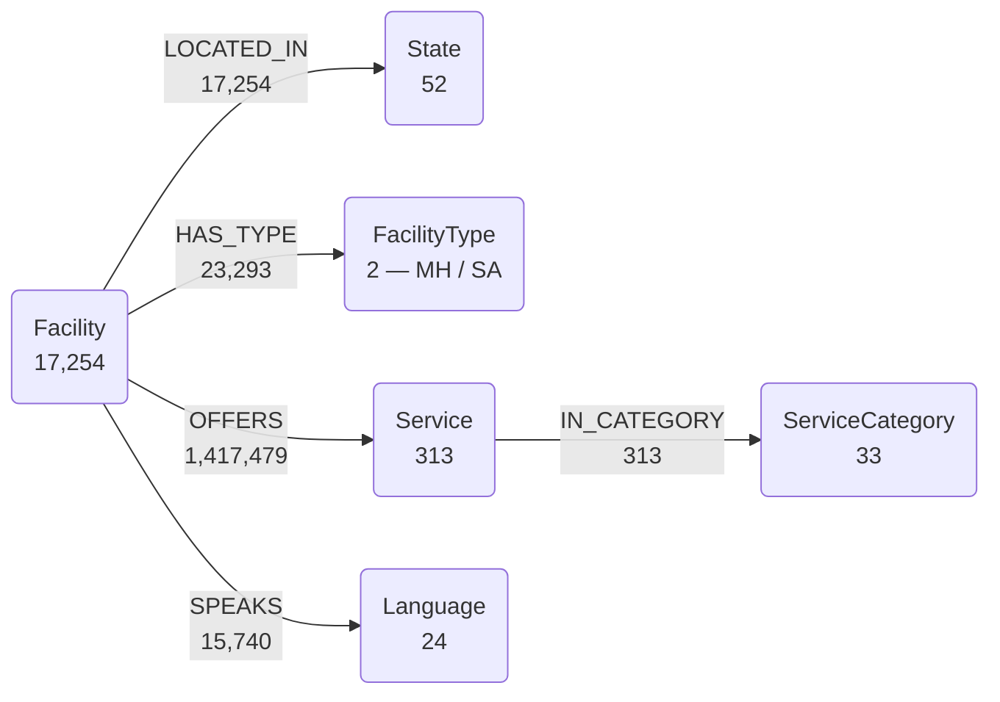

# Mental Health Knowledge Graph

**17,678 nodes. 1,474,079 edges. Every US behavioural-health facility, the services it offers, the languages it speaks and how it is paid for — from one federal source.**


> Part of the **Samyama** ecosystem — loaded into and queried via the graph engine at [samyama-ai/samyama-graph](https://github.com/samyama-ai/samyama-graph).
> This repo holds the loader and source-data specifics for the KG.

<a href="LICENSE"></a>

---

We loaded all 17,254 facilities from [FindTreatment.gov](https://findtreatment.gov) into one graph, then asked the question a survivor advocate actually asks:

> *"Where can a survivor of intimate partner violence get trauma counselling, in Spanish, on a sliding fee scale?"*

```cypher
MATCH (f:Facility)-[:OFFERS]->(a:Service),
      (f)-[:OFFERS]->(b:Service),
      (f)-[:OFFERS]->(c:Service)
WHERE a.value = "Clients who have experienced intimate partner violence, domestic violence"
  AND b.value = "Sliding fee scale (fee is based on income and other factors)"
  AND c.value = "Spanish"
RETURN f.name, f.city, f.intake
```

**Named facilities with intake numbers, not one generic hotline.** 6,072 facilities nationally are tagged as serving IPV survivors. Powered by [Samyama Graph](https://github.com/samyama-ai/samyama-graph).

---

## Demo

A narrated walkthrough, scoped to Massachusetts so it loads in seconds: load -> who the
data names -> the multi-constraint referral -> the exclusion query -> the coverage gap.
Every number is real federal data.

```bash
docker run -d --name samyama-demo -p 18080:8080 \
  public.ecr.aws/f9f6l5u4/samyama-graph:1.1.0                           # needs a server
MH_URL=http://localhost:18080 python -m demo.demo                       # run live
asciinema rec --overwrite --cols 92 --rows 32 --idle-time-limit 2.0 \
  -c "bash -c 'python -m demo.demo'" demo/mental-health.cast            # re-record
agg --font-size 14 --speed 1.4 demo/mental-health.cast demo/mental-health.gif   # → gif
```

> The demo needs a **server**, not the embedded client. PyPI `samyama` 0.6.1 inverts
> `OPTIONAL MATCH` exclusion — step 4 returns the 11 facilities that *do* offer the
> excluded service instead of the 127 that do not. See [`docs/schema.md`](docs/schema.md).

---

## Schema



**6 node labels** -- Facility (17,254), Service (313), State (52), ServiceCategory (33), Language (24), FacilityType (2)

**5 edge types** -- OFFERS, HAS_TYPE, LOCATED_IN, SPEAKS, IN_CATEGORY

**Data source** -- [FindTreatment.gov](https://findtreatment.gov) (SAMHSA / BHSIS) — US federal government work, public domain. New facilities monthly; services and phones updated weekly.

See [`schema/mental_health_kg.cypher`](schema/mental_health_kg.cypher) for constraints and
[`docs/schema.md`](docs/schema.md) for design decisions, sources and deferred layers.

## Quick Start

```bash
python -m venv .venv && source .venv/bin/activate
pip install -e .

python -m etl.download_data          # fetch source data into data/
python -m etl.loader                 # build + load the graph
python -m mcp_server.server          # expose the KG over MCP
pytest                               # run tests
```

## Structure
```
etl/          # downloaders + graph loader
schema/       # cypher schema / ontology
mcp_server/   # MCP server exposing the KG
demo/         # narrated demo (cast + gif)
benchmarks/   # benchmark queries
docs/         # design + source notes
tests/        # pytest
pyproject.toml
```

---
_Data is US federal government work and public domain; this repo is Apache 2.0. The graph
holds facilities, services and provenance — never survivors, sessions or contact records._
