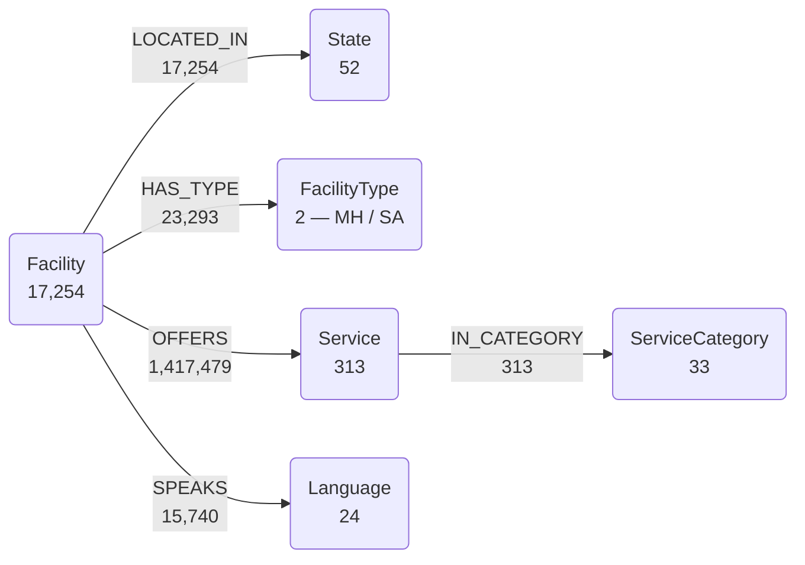

# Mental Health KG — Design Notes

**v0.1 — US behavioural-health services layer.**

US mental-health and substance-use treatment facilities, with the services they
offer, the languages they speak, the populations they serve and the payment they
accept. Built for referral routing: *which help exists where, for whom, in what
language.*

Measured on a full national load, 2026-08-10.

## The graph at a glance

`Facility` is the hub — every other label hangs off it, except `ServiceCategory`
which groups services. `OFFERS` carries 96% of all edges.

## Scale

| | |
|---|---|
| Facilities | **17,254** |
| Nodes | **17,678** |
| Edges | **1,474,079** |
| Snapshot | 9.0 MB gzipped (105 MB raw) |

## Node labels

| Label | Count | Key | Fields |
|-------|------:|-----|--------|
| Facility | 17,254 | `facility_id` | name, name2, street1, street2, city, state, zip, phone, intake, hotline, website, latitude, longitude |
| Service | 313 | `service_id` | category_code, value |
| State | 52 | `code` | — |
| ServiceCategory | 33 | `code` | name |
| Language | 24 | `name` | — |
| FacilityType | 2 | `code` | name — `MH` \| `SA` |

## Edge types

| Edge | From → To | Count | Properties |
|------|-----------|------:|-----------|
| OFFERS | Facility → Service | 1,417,479 | — |
| HAS_TYPE | Facility → FacilityType | 23,293 | — |
| LOCATED_IN | Facility → State | 17,254 | — |
| SPEAKS | Facility → Language | 15,740 | — |
| IN_CATEGORY | Service → ServiceCategory | 313 | — |

## Design decisions

**`HAS_TYPE` is an edge, not a property.** The source lists each physical facility
**once per care type** — the same name and address returns as one `MH` row and one
`SA` row, each carrying its own service list. A facility can genuinely be both, and
**6,039 of 17,254 (35%) are**. Storing the type as a property would silently keep
whichever row was seen first and discard the other. The loader accumulates across
both rows.

**`Service` is a (category, value) pair.** The API packs several values into one
semicolon-delimited string per category, so `service_id` is `"{category}::{value}"`
— e.g. `SG::Adult women`. Keeping the category as an edge to `ServiceCategory`
rather than a property means *"which facilities offer anything under Payment
Assistance"* is one traversal.

**`Language` is lifted out of `Service` deliberately.** Referral matching turns on
it directly, so it earns its own label. The same values remain reachable as
Services under categories `SL` (Language Services) and `OL` (Other Languages).

**`miles` is not modelled.** It is the distance from the query point — a property
of the request, not of the facility, and meaningless once stored.

## Node identity

The API supplies **no stable identifier**. `_irow` is a per-response row index that
changes between queries.

`facility_id` is minted as `"ft-" + sha1(name|street1|city|state|zip)[:16]`.
Facilities are therefore deduplicated by **exact match** on that tuple; a facility
listed under two spellings appears as two nodes. Names are not normalised.

This is correct behaviour for multi-site organisations — Casa Esperanza Inc has
four sites on Eustis Street in Roxbury and is four `Facility` nodes, which is what
referral routing needs.

## Source

| | |
|---|---|
| Source | **FindTreatment.gov** — SAMHSA / BHSIS facility locator |
| API doc | v1.11, 2026-05-26 |
| Endpoint | `GET /locator/exportsAsJson/v2` |
| Licence | **US federal government work — public domain** |
| Refresh | **annual** (N-MHSS survey) — see *Data currency* below |

## Data currency

Checked 2026-08-13, because "how often does it update?" has a more awkward answer than
the headline numbers suggest, and every filter in this graph depends on it.

| Layer | Publisher cadence | What actually moves |
|---|---|---|
| FindTreatment.gov | annual survey; monthly additions; weekly corrections | the **weekly channel is opt-in** — it fires only when a facility notifies SAMHSA |
| HRSA HPSA | file rebuilt **daily** | designations themselves change rarely |
| Synthea | not a feed — a generator | pinned by jar version + `-s` seed |
| Census ACS | annual, 5-year estimates each December | inherently lags 1–2 years |

**FindTreatment.gov.** SAMHSA's own wording: *"All information in the Locator is updated
annually based on facility responses to SAMHSA's National Mental Health Services Survey…
updates to facility names, addresses, telephone numbers and services are made weekly, if
facilities inform SAMHSA of changes."* The systematic refresh is therefore yearly. Phone
numbers may be fresher than service tags, and the service tags — `IPV`, languages,
sliding-fee scale — are exactly what this graph filters on. Treat them as up to a year old.

**NPPES.** Monthly full-replacement file, and the freshest layer here: the copy loaded was
published 2026-08-10 covering NPIs through 2026-08-09. There is no incremental feed worth
using at a monthly cadence. Same caveat as HRSA applies in principle — the file carries a
per-record `Last Update Date`, so record-level staleness is measurable and has not been
measured yet.

**HRSA HPSA.** The daily rebuild gets you a fresh *file*, not fresh *facts*. Measured
across the 13,836 designated mental-health rows in our copy:

| Last updated | designations | |
|---|---:|---:|
| under 90 days | 1,053 | 8% |
| 90–365 days | 10,159 | 73% |
| 1–3 years | 823 | 6% |
| over 3 years | 1,801 | 13% |

Newest update 2026-08-05, oldest 2016-09-22; designation dates run back to **1973**.

**Consequence.** The graph is only as current as its slowest authoritative layer, and that
is annual. Rebuilding weekly would re-download near-identical service data for ~6 minutes
of fetch and ~14 minutes of load. **Monthly is the recommended rebuild cadence** — it
catches the genuinely monthly channel (new facilities) and HRSA churn without implying a
currency the source does not have. There is no incremental feed for either source; both
are full snapshots.

Fetch dates are recorded in the graph itself as `:DataSource` nodes, so a `.sgsnap` says
how old it is without reference to this document.

### API defects worked around

Recorded because they cost time and are not in the published documentation.

1. **Coordinates are `"{lat},{lng}"`, not `"{lng},{lat}"`.** Appendix A of the
   developer guide states longitude first; the worked examples in the same document
   use latitude first, and only that order returns rows. The reversed order **fails
   silently** — HTTP 200 with `recordCount: 0` rather than an error.
2. **No stable facility identifier** — see *Node identity* above.
3. **Malformed queries return HTTP 200** with a bare text body rather than JSON, so
   the loader treats a JSON decode failure as a parameter error.

### Engine defects encountered

Found while querying the loaded graph. All three affect anyone building a KG from the
shared template, which pins `samyama>=0.6.0` and therefore resolves to **0.6.1**.

The third is the serious one: **negative constraints cannot be expressed at all in
SDK 0.6.1**, so any KG needing "matching X but not Y" must run against a server.

- **`RETURN DISTINCT` is a silent no-op** in SDK 0.6.1. `count(DISTINCT …)` and
  `WITH DISTINCT …` both work correctly. Reproduced minimally: 3 identical nodes +
  1 different, `RETURN DISTINCT p.name` returns 4 rows instead of 2. The engine at
  v1.1.0 carries a regression test (`test_return_distinct_values`) asserting the
  correct behaviour, so this appears fixed but unpublished.
- **`EXISTS { … }` block syntax is not supported** — parse error.
- **`OPTIONAL MATCH … WHERE x IS NULL` returns the exact inverse** in SDK 0.6.1, so the
  usual workaround for the above is itself unusable. On the MA subset, "IPV survivors +
  trauma counselling, excluding opioid-use-disorder-only programmes" should be 127 of
  138; embedded 0.6.1 returns **11** — precisely the 138 − 127 that *do* offer the
  excluded service. Six formulations were tried and none work embedded: `OPTIONAL MATCH`
  with the predicate in `WHERE` or inline, `WITH DISTINCT` first, `count(x) = 0`, and
  `size(collect(x)) = 0` all return 11 or an empty result; `NOT (f)-[:OFFERS]->(:Service
  {…})` and `WHERE NOT "…" IN collect(…)` are parse errors. The **server engine (1.7.0)
  answers all of them correctly** — verified at 127 and 67 against an independent count
  over the source CSVs. This is why `demo/demo.py` requires a server.
- **A `WHERE` cannot be followed by another `MATCH`.** Match every required pattern in
  one `MATCH`, then `WITH`, then the optional part.
- **`ORDER BY` is inverted between aggregates and plain properties, and fails silently —
  no error, just unsorted output.** Verified 2026-08-13 on the loaded graph:

  | value being sorted | works | silently unsorted |
  |---|---|---|
  | aggregate — `count(f) AS n` | `ORDER BY n` | `ORDER BY count(f)` |
  | property — `h.count AS n` | `ORDER BY h.count` | `ORDER BY n` |

  This is the dangerous class of defect: a "top 5 by volume" table comes back in
  insertion order and looks perfectly plausible. It shipped into a demo recording
  before it was caught. Sort in the form that matches the value, or use
  `WITH … ORDER BY …` which works for both.
- **RETRACTED 2026-08-18 — the "DETACH DELETE corrupts the property index" claim.**
  This section previously reported that deleting a layer and reloading it attached
  edges to unrelated nodes, citing 5,197 `IN_STATE` edges for 3,043 counties. **It
  does not reproduce.** On a fresh container, delete-and-reload is exact, and a
  3,000-node reproduction produced correct results.

  The original observation was contaminated by a different, real defect: **the
  engine ignores the `graph` parameter**, so what looked like isolated test graphs
  were one shared graph accumulating data across runs
  ([samyama-graph#15](https://git.samyama.ai/Samyama.ai/samyama-graph/issues/15)).
  Any measurement that assumed graph isolation — including the "236 of 3,536 edges
  written silently" claim also previously recorded here — has to be treated as
  unreliable.

  What survives: loaders still refuse to run against a non-empty layer, because
  they use `CREATE` and re-running genuinely does duplicate. Starting from a fresh
  container and importing a snapshot (~4 s) remains the recommended route — but
  because it is simple and fast, not because in-place deletion is unsafe.

- **`batch_create_edges` from the shared template does not scale.**- **`batch_create_edges` from the shared template does not scale.** It emits one `MATCH`
  pattern per edge — 300+ per query — and its cost grows with the number of nodes already
  carrying the matched label. It SIGKILLed the server (exit 137, which reads as host OOM
  and is not) at 3,500 `Patient` nodes, and silently created only 236 of 3,536 edges when
  the batch spanned many distinct `State`/`Taxonomy` pairs. Use a set-based form instead:
  `MATCH (s:X) WHERE s.key IN [...] WITH s MATCH (t:Y) WHERE t.key = "..." CREATE ...`,
  which is two patterns regardless of batch size and ran ~5× faster. Every KG repo copies
  this helper verbatim.

## Planned — not in v0.1

Lifted from the remaining service categories, all present in the data:

| Category | Becomes |
|---|---|
| `SG` Special Programs/Groups | `Population` — Adult women, Pregnant/postpartum women, Seniors |
| `AGE` Age Groups Accepted · `SN` Sex Accepted | eligibility on `Population` |
| `EXCL` Exclusive Services | **negative** eligibility — *"Opioid use disorder clients only"* |
| `PAY` · `PYAS` Payment / Assistance | `Payment` — so "takes Medicaid AND has a sliding scale" is a traversal |

Also planned: **County** nodes (the API supports county search) so referral routing
works below state level.

## Later layers — deferred, not dropped

The following were scoped in the original schema proposal and remain valid as later
phases. They are deferred because the US services layer is what the lead use case
needs first.

| Layer | Sources | Note |
|---|---|---|
| Disease burden | CDC NISVS, WHO VAW database, IHME GBD | population prevalence |
| Social determinants | World Bank WDI | — |
| Clinical evidence | ClinicalTrials.gov, PubMed | — |
| Therapy + biology | ChEMBL, SIDER/FAERS, OpenTargets | — |
| DV service directories | DomesticShelters.org (~3,000 US/Canada programs), NNEDV state coalitions | ★ closest fit to referral routing; **no public API — needs outreach** |

## Excluded on purpose

- **DSM-5** — APA copyright; cannot be ingested or redistributed. ICD-11 and MeSH
  give equivalent coverage and are free. (The original scaffold's
  `Condition.dsm_code` field was removed for this reason.)
- **PGC psychiatric GWAS summary statistics** — free for scientific research, but
  commercial use requires Data Access Committee permission.
- **UMLS, SNOMED CT** — licence required.
- **Scraped social-media mental-health corpora** — no informed consent, real
  re-identification risk.

## Not modelled

- **Individual-level records of any kind.** This KG is facility, service and policy
  level only. No patients, no survivors, no sessions.
- **`Condition -[:HAS_SYMPTOM]-> Symptom`** (in the original scaffold) — no open
  dataset provides a usable symptom–disorder mapping, and the ones that do are
  DSM-derived. Modelling it would also make the graph diagnosis-shaped, which is out
  of scope by design.
- **Inverse edges.** Relationships are declared in one direction only; Cypher
  traverses both ways, so a `TREATED_BY` to pair with `TREATS` is redundant storage
  and a source of drift.

## Scope statement

This graph describes services, facilities and policy. It is **not** a diagnostic or
screening tool and must not be presented as one.
